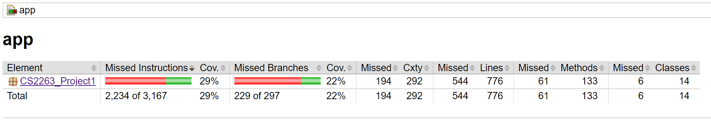

# CS2263_Project1 - Acquire

## About

This project is a fully functional computer game version of the game [Acquire](https://en.wikipedia.org/wiki/Acquire), a game about hotels, stocks, and making money.

### Minimum Viable Product:

- Two players sharing a system will be able to play together hotseat style.
- All game data can be saved to a file and loaded from a file at runtime.
- Will, without errors or diverging from the rules of the physical game (consistent game logic), be able to handle player turns, merges, stocks, and banking.
- Will have a GUI
- Will be designed with 3 or more design patterns evident.

## Getting Started

This is a Gradle project, which requires end users to have an up to date Gradle installation to run it.

### Windows

Open *git bash* and navigate to your desired directory and clone the repository to your machine using ``` git clone https://github.com/TeamGroup-Org/CS2263_Project1.git ```

Open *Command Prompt* and set your current directory to the project location. Next, run: ```gradle build``` And then launch the GUI using ```gradle run```

## Usage

From the home screen you can begin a new game, load one from a locally stored file, or exit the program.

Beginning a new game brings you to the game view of the application, where there is a gameboard, player turn indicator, player hand and stock counts, as well as money totals and the ability to perform various in game actions.

## Version v1.1.0

*Code Coverage: 29%*

### Overall Coverage


### Detailed Coverage


## Contributors

- David Hellwig - Team Lead, Development, QA
- Noah Owens - Git Lead, Development, UI Designer
- Coby Garner - UI Designer, Development
- Ekow Barlow - Development

## Contributing Guidelines

This is currently a class project, and no contributions from outside the credited contributors will be accepted.
